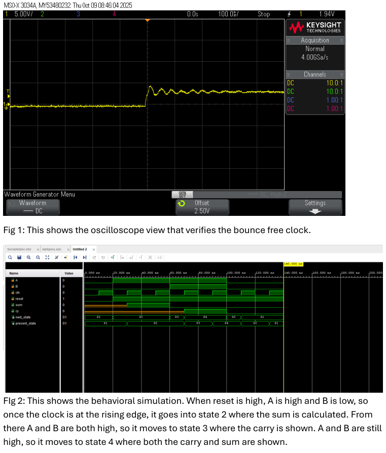
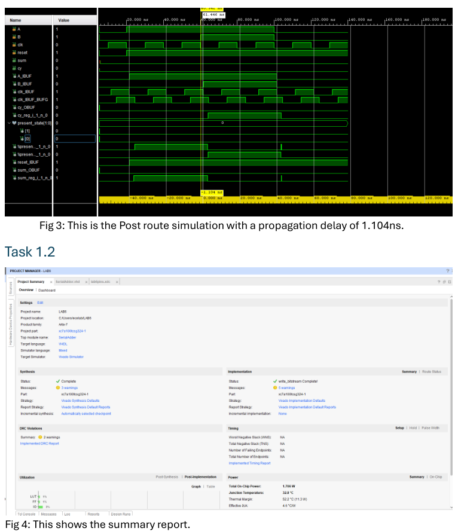
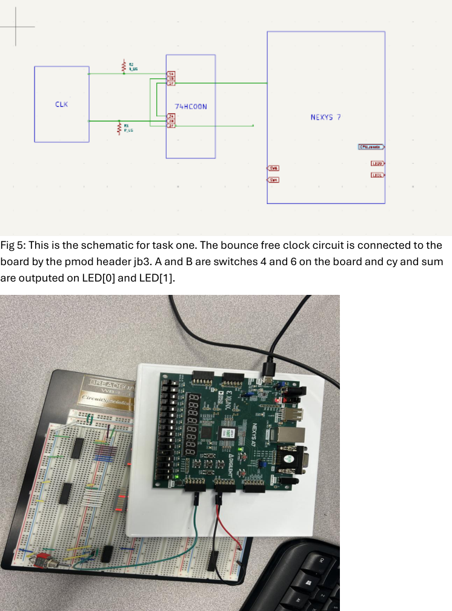
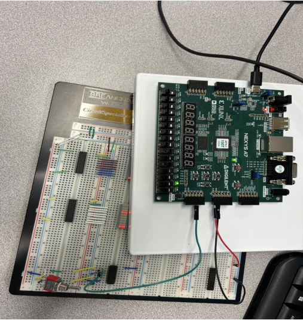
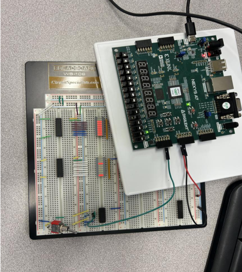
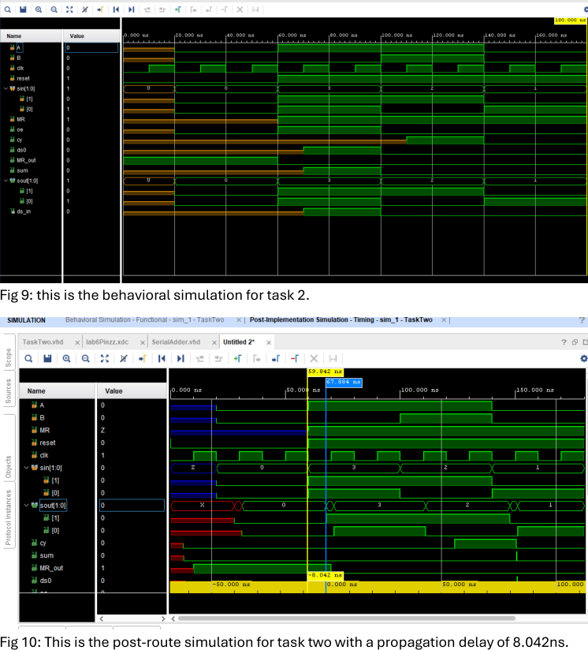
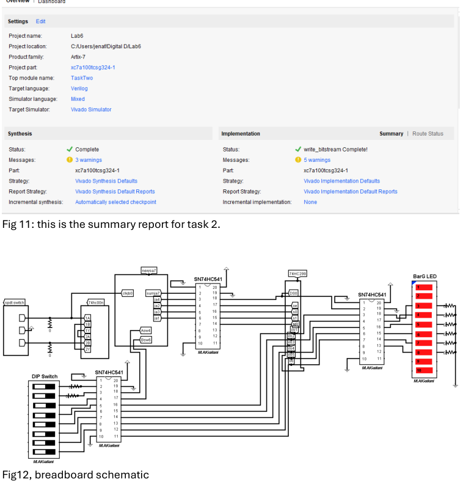
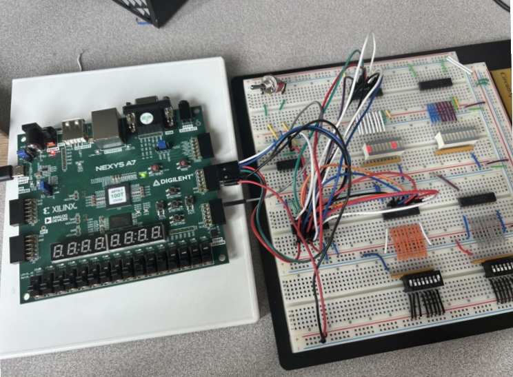
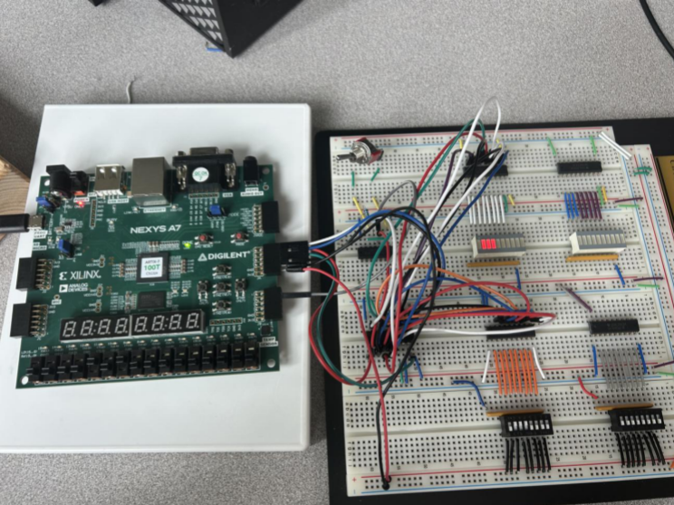
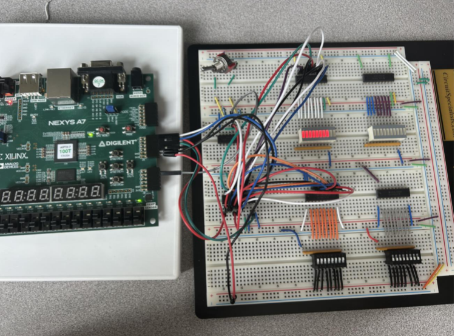

# Synchronous Sequential Circuits (Bit‑Serial Adder + 74HC299 Interface)

This lab is where things stop being “just combinational logic” and start behaving like real digital systems: **state, clocking, and timing**.
We built a **Moore-style bit‑serial adder** (with a bounce‑free manual clock) and an FPGA interface circuit for a **74HC299 shift register** that supports **parallel load, shift right, and hold**.

---

## Repo description (GitHub description box)

**Option A:** Sequential VHDL lab on Nexys A7: Moore bit‑serial adder with a bounce‑free manual clock plus a 74HC299 shift‑register interface, verified in behavioral + post‑route simulation and on hardware.

**Option B:** Bit‑serial adder + 74HC299 shift-register interface in VHDL on Nexys A7 (sim + hardware verification).

---

## What’s in this repo

- **Task 1:** Moore bit‑serial adder (4-state FSM) + bounce‑free manual clock input
- **Task 2:** 74HC299 shift register interface (parallel load / shift right / hold) using DIP switches + LED bar
- Tcl force patterns used for simulation
- XDC pin mappings for Nexys A7 switches/LEDs + Pmods
- Screenshots: schematics, sim waveforms, post-route timing, and hardware photos

---

## Suggested folder layout

```
.
├─ src/
│  ├─ SerialAdder.vhd
│  └─ TaskTwo.vhd
├─ sim/
│  ├─ task1_forces.tcl
│  └─ task2_forces.tcl
├─ constraints/
│  ├─ task1.xdc
│  └─ task2.xdc
├─ assets/
│  ├─ task1_scope_and_behavioral.png
│  ├─ task1_postroute_and_summary.png
│  ├─ task1_schematic_and_setup.png
│  ├─ task1_hw_states_2_3.png
│  ├─ task1_hw_state_4.png
│  ├─ task2_behavioral_and_postroute.png
│  ├─ task2_summary_and_breadboard_schematic.png
│  ├─ task2_hw_photo_1.png
│  ├─ task2_hw_photo_2.png
│  └─ task2_hw_photo_3.png
└─ report/
   └─ ECE 4525 Lab 6 Report.pdf
```

---

## Task 1 — Moore bit‑serial adder + bounce‑free clock

### Bounce‑free manual clock (scope + sim)
The report includes a scope capture verifying the button-driven clock is stable (no multi-edge bounce),
plus the behavioral waveform showing the FSM stepping through its states.



### Post‑route timing
Post-route simulation reports a propagation delay of about **1.104 ns**.



### Schematic + hardware setup
Clock circuit is brought in via Pmod **JB3**; `A` and `B` come from switches; outputs appear on `LED[0]` and `LED[1]`.



Example hardware states:




### Code snippets (Task 1)

```vhdl
type state_type is (S1, S2, S3, S4);
signal next_state, present_state : state_type := S1;

process(present_state, A, B)
begin
  case present_state is
    when S2 => sum <= A xor B;
    when S3 => cy  <= (A and B);
    when S4 =>
      sum <= A xor B;
      cy  <= (A and B);
    when others => null;
  end case;
end process;

process
begin
  wait until (clk'event and clk = '1');
  if reset = '0' then present_state <= S1;
  else present_state <= next_state;
  end if;
end process;
```

---

## Task 2 — 74HC299 shift register interface

### Behavioral + post-route timing
The post-route propagation delay is reported as about **8.042 ns**.



### Summary + breadboard schematic


### Hardware verification




### Code snippets (Task 2)

```vhdl
sout   <= sin;
MR_out <= not reset;
oe     <= sin(0) and sin(1);

SBA: SerialAdder port map(
  clk   => clk,
  reset => MR,
  A     => A,
  B     => B,
  cy    => cy,
  sum   => ds_in
);

ds0 <= ds_in;
sum <= ds_in;
```

---

## Run it (Vivado)

1. Create a Vivado project targeting **Nexys A7**.
2. Add the VHDL for the task you want (`SerialAdder.vhd` / `TaskTwo.vhd` + dependencies).
3. Add the matching XDC (`constraints/task1.xdc` or `constraints/task2.xdc`).
4. Run behavioral sim + post-implementation timing sim.
5. Program the FPGA and compare results to the screenshots in `assets/`.

---

## Report

See `report/ECE 4525 Lab 6 Report.pdf` for the full procedure and appendix code.
